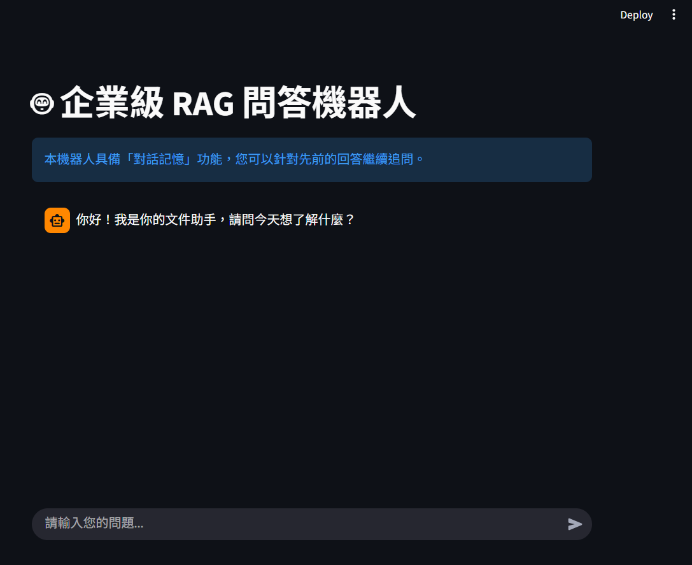

## 🌟 版本更新 (V2: Web UI & Memory)

此版本將系統遷移至 **Streamlit** 網頁介面，並引入了 `ConversationBufferMemory` 實現多輪對話能力。

## 🖥️ 功能展示 (Application Walkthrough)

### 1️⃣ 專業網頁入口 (Landing Page)
系統採用 Streamlit 構建，啟動時會自動優化加載 Embedding 模型與向量資料庫，確保流暢體驗。

### 2️⃣ 互動式思考反饋 (User Experience)
當使用者送出問題後，系統會進入「思考模式」，利用 Spinner 提示背景正在進行 RAG 檢索，提供極佳的互動感。

### 3️⃣ 多輪對話與溯源 (Memory & Citation)
系統內建 `ConversationBufferMemory`，能理解對話脈絡。即使是追問「那它的架構呢？」，AI 也能正確識別主語為 BERT 並附上論文頁碼。

### 4️⃣ 內容邊界安全防禦 (Safety Guardrail)
嚴格執行 Prompt Engineering 規範，若問題超出 PDF 知識庫範疇，系統將拒絕回答，有效防止 AI 幻覺。
