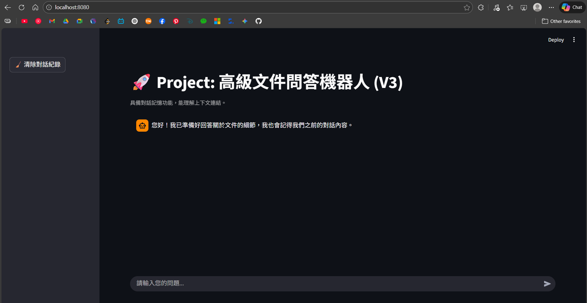
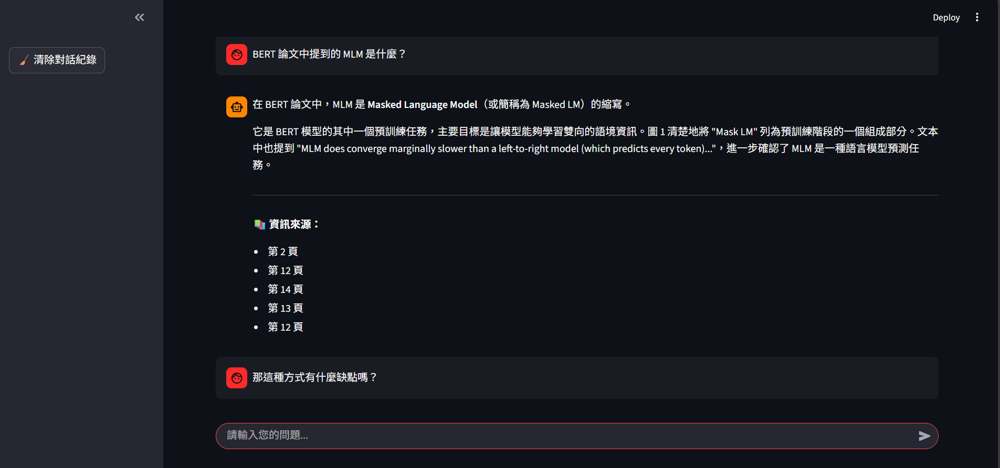
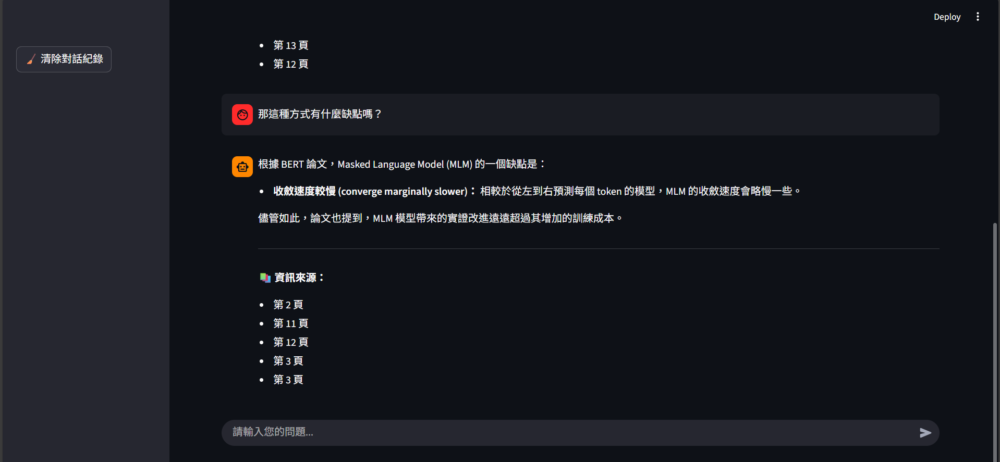
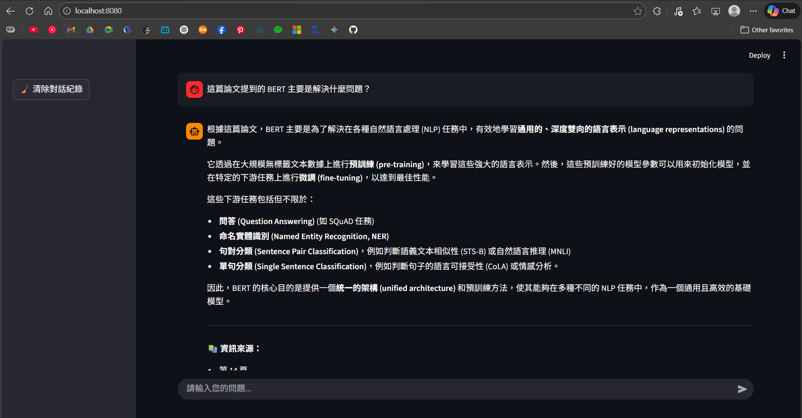
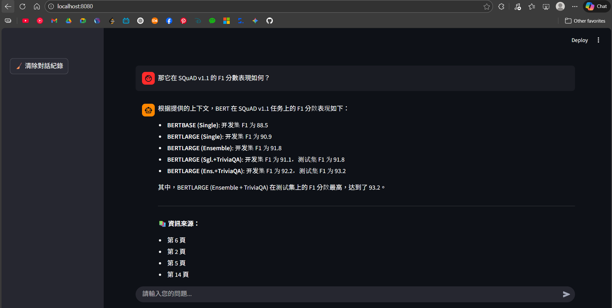
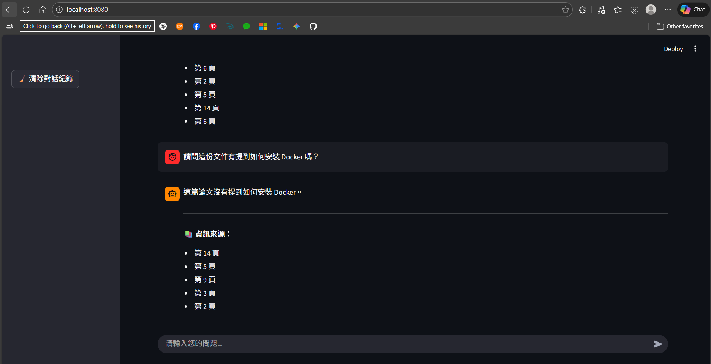
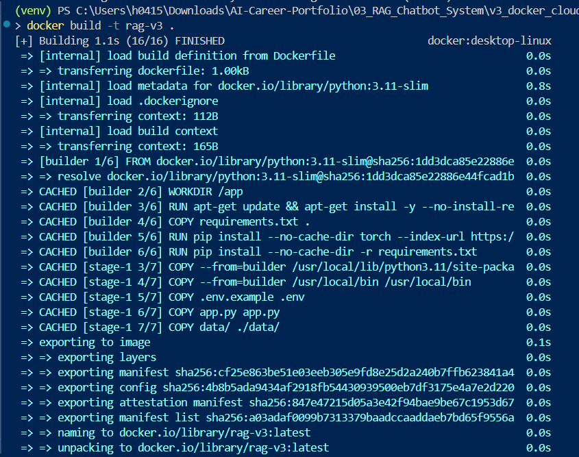
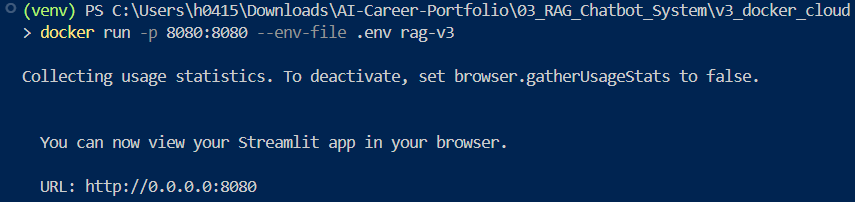

## 🖼️ 功能展示 (Demo)

### 1. 專業介面與系統配置 (UI/UX Upgrade)
系統採用 Streamlit Wide Layout 佈局，並具備側邊欄管理功能。

---

### 2. 深度對話記憶測試 (Contextual Memory Demo)
驗證系統對上下文的理解能力，即使在追問中省略主語，AI 也能透過對話紀錄推斷意圖。

* **問：** BERT 論文中提到的 MLM 是什麼？

* **追問：** 那這種方式有什麼缺點嗎？ (成功識別主語為 MLM)

---

### 3. 多維度 RAG 效能驗證
針對專業論文內容進行精確度與邊界測試。

* **精確度測試：** 詢問 SQuAD v1.1 的 F1 分數，AI 成功從論文摘要提取出 **93.2**。

* **邊界測試 (Edge Case)：** 詢問 Docker 安裝方法，AI 依據 Prompt 規範誠實回答，有效防止幻覺。

---

## 🐳 開發者日誌：DevOps 與部署 (Deployment)

### A. Docker 映像檔構建
利用 Multi-stage Build 技術，大幅縮減 Production Image 體積。

### B. 容器化運行環境
透過 Docker 容器化技術，實現環境一鍵遷移與隔離運行。
