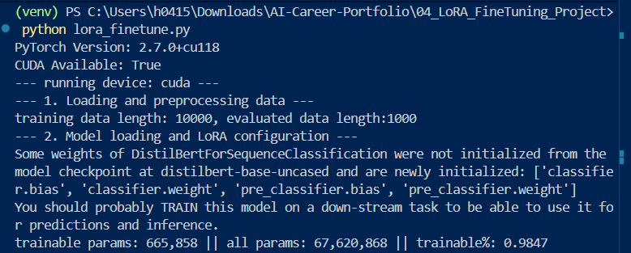
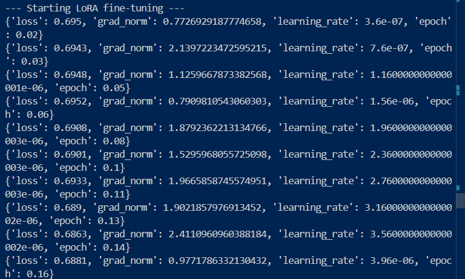
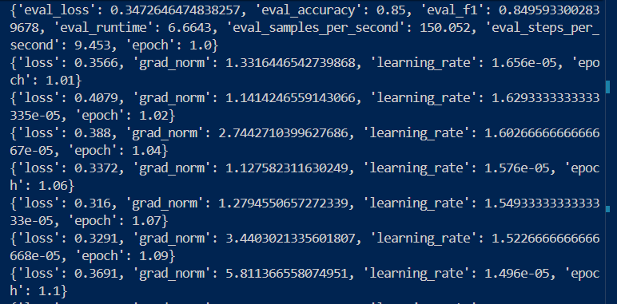
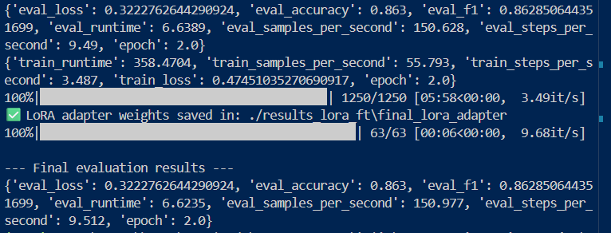

## 🧪 專案 4：LoRA 參數高效微調實踐 (IMDb 情感分析)

本專案展示了如何使用 LoRA (Low-Rank Adaptation) 技術，在有限的運算資源下針對 DistilBERT 進行特定任務的微調。

### 📊 1. LoRA 技術核心指標 (PEFT Stats)
透過 PEFT 庫注入 LoRA 權重，我們僅訓練了不到 1% 的參數，這大幅降低了顯存壓力。

*註：可以看到 trainable params 僅佔總參數的 0.98%。*

### 📉 2. 訓練收斂過程 (Training Log)
訓練過程中，Loss 穩定下降且 Learning Rate 遵循線性預熱與衰減策略。

### 🏆 3. 最終評估成果 (Final Evaluation)
模型在 IMDb 測試集上達到了 **86.3%** 的準確率與 F1 Score。

### 🤖 4. 模型推理實測 (Inference Success)
實際測試微調後的模型，能夠精準判別電影評論的正負面情感。

> **💡 觀察筆記：**
> 模型對於「Masterpiece」與「Disappointment」等強烈詞彙反應非常精準。對於中性模糊評論（如：It's an okay film...）判定為 Negative 是正常的，因為 LoRA 微調使模型更傾向於捕捉數據集中的極化情感特徵。