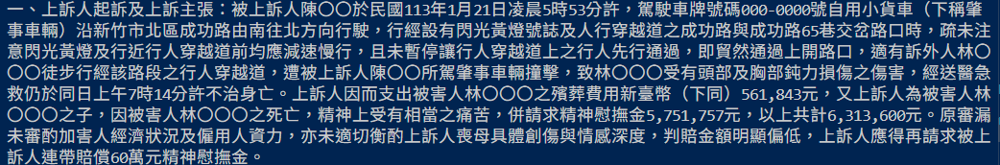
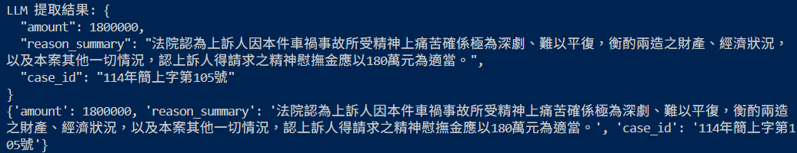
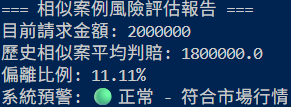

# InsureCheck-AI: 產險智能審閱與風險預警系統

## 📌 專案背景
在產險理賠流程中，「**精神慰撫金**」與「**體傷賠償**」的審核往往高度依賴理賠員的個人經驗，導致標準不一且法律檢索耗時。本專案利用 **Large Language Models (LLM)** 與 **Retrieval-Augmented Generation (RAG)** 技術，實現裁判書的自動化結構化分析，將理賠審核從「經驗驅動」轉型為「數據驅動」。

---

## 🚀 核心功能

### 1. 金融級數據去識別化 (De-identification)
* **技術實現：** 結合 `Regular Expression` 與 `SpaCy (zh_core_web_trf)` 深度學習模型。
* **功能：** 自動辨識並遮蔽裁判書中的當事人姓名、個資，確保數據符合金融資安合規。

### 2. 裁判書結構化提取
* **技術實現：** 利用 **LLM (Llama 3)** 的 **JSON Mode**。
* **功能：** 精準提取「判賠金額」、「法院核定理由」與「案號」，將非結構化文本轉化為生產級數據。

### 3. 智能 RAG 檢索與風險預警
* **技術實現：** 使用 `ChromaDB` 與 `BGE-v1.5` 高維向量模型。
* **功能：** 輸入新案情即可自動比對歷史相似判例，並計算申請金額之偏離度。若偏差 > 30% 即自動標註為「🔴 高風險案例」。

---

## 🛠 技術架構 (Technical Stack)

| 層級 | 技術選型 |
| :--- | :--- |
| **NLP Processing** | SpaCy (Transformer-based NER) |
| **LLM Engine** | Ollama / Llama 3 (8B) |
| **Vector Database** | ChromaDB |
| **Embeddings** | BAAI/bge-large-zh-v1.5 |
| **Workflow** | Python / Regex / JSON Mode |

---

## 📊 重點實作展示 (Screenshots)

### 🔹 數據去識別化與清洗

*圖說：展示系統如何辨識並遮蔽法律文書中的敏感個資。*

### 🔹 LLM 結構化分析結果

*圖說：LLM 精準提取金額與核定理由，並轉化為標準 JSON 格式。*

### 🔹 相似案例風險評估報告

*圖說：系統自動計算目前請求金額與市場行情的偏離比例。*

---

## 💡 未來優化方向 (Roadmap)

- [ ] **非同步批次處理 (Batch Processing)**：導入 `asyncio` 提升大規模數據處理的吞吐量。
- [ ] **進階 RAG 優化**：實作 Hybrid Search (BM25 + Vector) 提升法學專有名詞檢索精度。
- [ ] **監控儀表板**：結合 `Streamlit` 視覺化展示理賠趨勢與異常分佈。

---