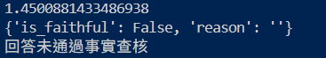
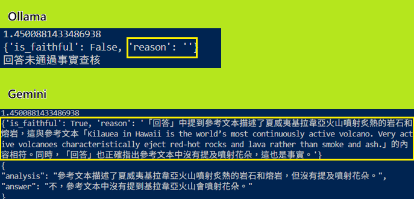

# Modular Self-RAG Agent: 多引擎科學知識問答系統

## 📌 專案背景
在 RAG (Retrieval-Augmented Generation) 系統中，LLM 容易產生「幻覺」或受限於單一引擎的效能。本專案透過 **物件導向設計 (OOP)** 實作了可擴展的檢索增強生成架構，並導入 **Self-RAG** 自我修正機制，確保系統在面對未知問題或模糊文本時，具備嚴謹的事實查核能力。

---

## 🚀 核心功能

### 1. 模組化 LLM 策略架構
* **技術實現：** 使用 Python `abc` 模組實作 **抽象基底類別 (Abstract Base Class)**。
* **功能：** 支援 `Ollama (Llama 3)` 與 `Gemini 2.5 Flash` 雙引擎切換，開發者僅需注入不同的 Engine 實例即可改變系統行為，提升代碼的可維護性。

### 2. 多層級 Self-RAG 驗證管線
* **技術實現：** 結合 `Vector Distance` 門檻與 `NLI (自然語言推理)` 邏輯。
* **功能：** * **檢索過濾 (Retrieval Grader)**：自動計算查詢與知識庫的向量距離，距離過遠 (> 1.5) 即判定為無相關知識。
    * **事實查核 (Faithfulness Check)**：將初步回答回傳給 LLM 擔任「查核員」，比對參考文本確保無編造事實。

### 3. 安全與格式控制
* **技術實現：** `python-dotenv` 管理 API Key 與 LLM **JSON Mode**。
* **功能：** 確保所有輸出均符合結構化 JSON 格式，便於下游系統介接，並防止金鑰洩漏。

---

## 🛠 技術架構 (Technical Stack)

| 層級 | 技術選型 |
| :--- | :--- |
| **LLM Interface** | Python abc (Abstract Base Class) |
| **LLM Engines** | Gemini 2.5 Flash / Ollama (Llama 3) |
| **Vector Database** | ChromaDB |
| **Data Source** | HuggingFace Datasets (SciQ) |
| **Security** | Dotenv (.env) Environment Management |

---

## 📊 重點實作展示 (Screenshots)

### 🔹 Self-RAG 驗證邏輯

*圖說：展示系統如何攔截「花朵是否會從火山噴出」等誘導性問題，並標註為「未通過事實查核」。*

### 🔹 雙引擎能力對比分析

*圖說：實測發現 Gemini 在否定命題的邏輯推論上優於 Llama 3，能提供更詳盡的查核原因。*

---

## 💡 未來優化方向 (Roadmap)

- [ ] **混合審核機制 (Hybrid Grading)**：使用小模型生成、大模型審核的成本優化方案。
- [ ] **多輪對話記憶**：導入 `ConversationBufferMemory` 實現具備上下文能力的 RAG。
- [ ] **非同步請求優化**：利用 `asyncio` 提升多模型並行驗證的速度。

---